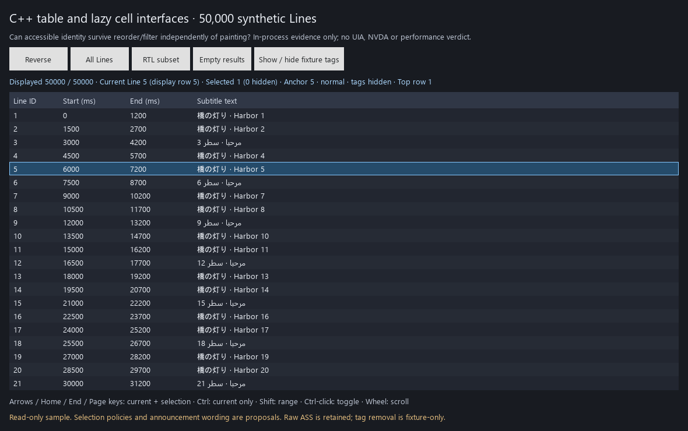

# Throwaway C++ painted-Grid accessibility probe

Question for [Prototype the painted grid's native accessibility and performance contract](https://github.com/altqx/hikari/issues/45): can real C++ Qt table/cell interfaces represent 50,000 synthetic Lines independently of painting, while retaining identity and selection through view changes?

**Bounded result:** yes for the exercised in-process Qt interface paths. Both installed Qt 6.11.2 kits built and ran the same source: MinGW 13.1.0 and latest MSVC 19.51.36260. Each run matched 22 observations. This removes the earlier missing Python table-interface binding as a C++ feasibility blocker. It does **not** establish Windows UIA table patterns, screen-reader usability, a production cache strategy, native input qualification or performance acceptance. The painted direction remains accepted; this does not choose a new renderer.



## Run

The launcher only uses installed tools, builds within ignored `_build/<kit>`, and records runs within ignored `_run/<UTC>-<kit>`. No downloads, install, user-data changes, media access or production application build.

From this directory, open the native interactive demo:

```powershell
& "$env:LOCALAPPDATA/HikariSub/prototype-runtime/Scripts/python.exe" -B run.py --kit msvc
```

Python is only a standard-library build/process launcher; this probe does not import PySide. The default demo uses the Windows Qt platform and software scene graph. Native UIA/screen-reader behavior in that interactive window has **not** been observed.

Reproduce the bounded in-process observations and an own-window capture:

```powershell
& "$env:LOCALAPPDATA/HikariSub/prototype-runtime/Scripts/python.exe" -B run.py --kit msvc --observe
& "$env:LOCALAPPDATA/HikariSub/prototype-runtime/Scripts/python.exe" -B run.py --kit mingw --observe
```

Observation mode uses `QT_QPA_PLATFORM=offscreen`, explicitly activates Qt accessibility, and installs an **in-process replacement update handler**. It does not test platform event forwarding. The output JSON, source hashes and capture—not process success alone—are the evidence. A failed observation produces a nonzero exit. This is a bounded experiment, not a shipping test suite.

## Exact environment and evidence

Executed on Windows 11 build 26200. Both final runs began at `2026-09-27T06:15:49Z`, using CMake 3.30.5 and Ninja 1.12.1 from `C:/Qt/Tools`. Source/executable/compiler/tool/config hashes and configure arguments are in each provenance record.

| Kit | Actual compiler and libraries | Preserved evidence |
|---|---|---|
| `C:/Qt/6.11.2/mingw_64` | Bundled `mingw1310_64` GCC 13.1.0, x86_64-posix-seh; matching MinGW Qt DLL paths observed inside process | [Observations](evidence/mingw/observations.json), [provenance](evidence/mingw/provenance.json), [capture](evidence/mingw/grid.png) |
| `C:/Qt/6.11.2/msvc2022_64` | VS Community 2026 toolset 14.51.36231, MSVC 19.51.36260, Windows SDK 10.0.26100.0; matching MSVC Qt DLL paths observed inside process | [Observations](evidence/msvc/observations.json), [provenance](evidence/msvc/provenance.json), [capture](evidence/msvc/grid.png) |

The Qt package directory's `msvc2022_64` name does not describe the compiler used here: CMake identified latest MSVC 19.51.36260. `VsDevCmd.bat -arch=x64 -host_arch=x64` supplies its temporary compiler/linker environment. MinGW remains prototype evidence only. This successful standalone link/run is a basic installed-kit ABI/runtime observation, not proof of full FFMS2/libass/Lua dependency compatibility, official provisioning/reconstruction, packaging, Linux or the stateless build ticket.

[Publication checks](evidence/publication.json) verify that both run records match the published source and retain post-run hashes of the Qt DLLs from their recorded loaded paths. These hashes were read after execution, not by an in-process hasher. Optional Vulkan headers were not found by CMake; neither build required them for this software path.

The offscreen plugin initially rendered without usable system fonts. Final observation runs load installed Segoe UI, Arial and MS Gothic bytes into **this process's** Qt application-font database, with hashes in the report. No fonts are installed, exported or included in the repository. The capture is actual `QQuickWindow::grabWindow()` output, not desktop automation or evidence of physical display/GPU completion. Mixed-direction text is visible; no linguistic/shaping correctness judgment is made.

## What the probe actually does

`PaintedGrid` is a `QQuickPaintedItem`. It generates text from stable IDs and paints only viewport rows. Display order and reverse lookup are separate from current/anchor/selected IDs. The 50,000-row source fixture contains original Japanese/Latin and Arabic/numeric samples with simple ASS override blocks. Its canonical UTF-8 ID/tab/raw-text/LF stream is 2,194,455 bytes, SHA-256 `9c80ec43283ebffcb11f3bece6a96e79d4331580f3105385a6bf4f3237e50287`. It is synthetic, not the accepted performance corpus.

The accessibility factory creates a real `QAccessibleTableInterface` plus `QAccessibleSelectionInterface`. Virtual cells supply `QAccessibleTableCellInterface` and focus/press/toggle actions. They are keyed by Line ID and column, registered with Qt IDs, and created only when queried; they are neither painted objects nor hidden QML delegates. A queried cell retains its identity when reordered. Filtering gives that retained cell row index `-1`/invisible state while keeping the underlying selected ID. Table selection exposes displayed selected rows; the status describes hidden selected IDs. This is a concrete policy for review, not an approved announcement or hidden-selection contract.

The 22 observed cases cover:

- Actual table/cell/selection casts; 50,000 rows, four columns, virtual offscreen lookup, repeat identity and invalid lookup.
- Accessible selection, current-focus separation, cell rectangle/hit testing, reverse-order identity, hidden selection and empty-view retention.
- Synthetic `QKeyEvent` **synchronous dispatch** through the Qt Quick window for Home, Ctrl-End and Shift range navigation. These are not physical keyboard events.
- Displayed versus retained raw fixture text; accessible press/toggle actions; column descriptions and explicit lack of column selection.
- Deletion of a second Grid releasing its three registered cells, plus observed in-process model-reset, selection and focus event types.

Each final run created 13 cells total, destroyed the temporary Grid's three cells, and retained ten on the main Grid. At most 21 rows were painted in a callback. These are object/row counts for the exercised path, **not timings or memory budgets**. The cache retains every queried cell until its Grid dies and can grow to the fixed fixture's 200,000 cells if a client enumerates everything; a bounded production eviction/lifetime design is not proven. Source rows cannot be inserted/deleted here. Model changes use a coarse reset; OS consumers retaining references, event ordering, granular updates and scroll/focus announcements need further qualification.

Column descriptions and cell names exist, but separate accessible header/row objects, a full text interface, editing, the complete Grid command set, multiline geometry and all ASS parsing are absent. The tag-hiding regex handles this fixture only. Wheel/point interaction is available for exploration but was not claimed as a hardware-input observation.

## Windows observer restriction and remaining boundary

The earlier [binding study](https://github.com/altqx/hikari/blob/72eee89191f60eece36ebd661a67702924d1a414/HikariSub/prototypes/painted-grid-accessibility/README.md) attempted `Windows PowerShell -NoProfile -File uia-observe.ps1`. Its retained first-run result is exit 1 / `UnauthorizedAccess`: script execution was disabled. This continuation did **not** change execution policy, use a bypass, port the observer to another route, invoke it again, or claim any Windows UIA observation.

Next required evidence remains independent OS table/selection/focus patterns and NVDA, Linux AT-SPI/Orca, actual keyboard/IME, reference-host performance/resource calibration and production cache/lifetime semantics. GitHub Actions may provide Linux build/synthetic checks; it does not by itself provide a human desktop/Orca session. No budget or platform gate is waived.

Concrete review question, once the permitted OS observer and screen-reader session exist: should current-row movement announce the current cell, the selected count and hidden-selected count separately, and how should a filtered-out current Line be exposed? This prototype makes those states queryable; in-process success cannot choose the speech/focus experience. **The native Grid ticket remains open.**
