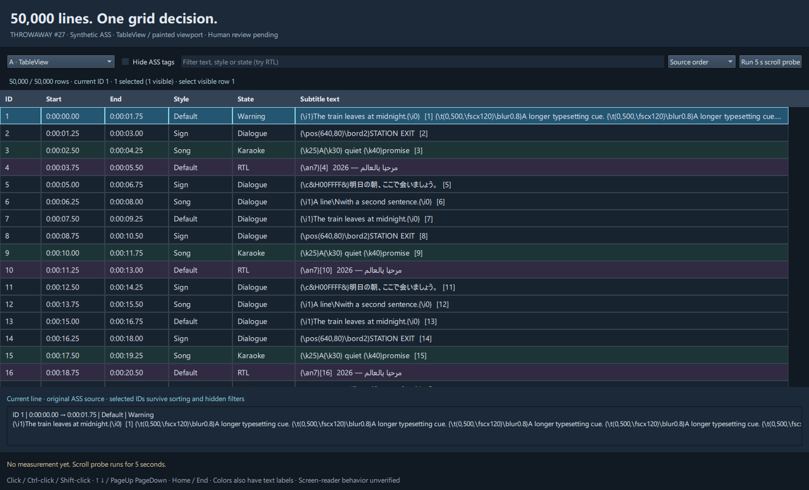
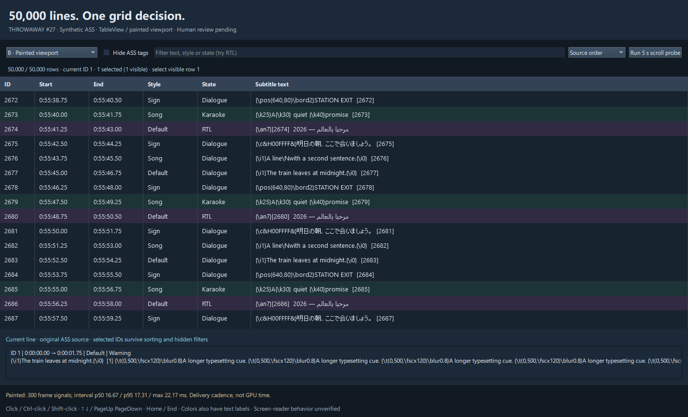

# Throwaway grid prototype — issue #27

Question: can a recycled QML TableView provide the grid behavior and performance we need, or is a custom painted viewport worth its extra input/accessibility work? Two interchangeable renderers use the same in-memory rows, filter/order mapping and ID-based selection. This is a native runtime comparison, so it deliberately keeps their layout equivalent rather than using unrelated visual compositions. **No renderer has been selected. Human reaction is pending.**

## Run

On this workstation, from the repository checkout:

```powershell
& "$env:LOCALAPPDATA\HikariSub\prototype-runtime\Scripts\python.exe" HikariSub/prototypes/qml-grid/main.py
```

Elsewhere: install `PySide6-Essentials==6.11.2` in a disposable Python 3.12 virtual environment, then `python HikariSub/prototypes/qml-grid/main.py`. No app build, external media or persistence is required. The Python binding is a prototype convenience, not a product language decision.

Use the renderer switcher, tag-hiding toggle, filter (try `RTL`, `Warning`, `Song`), and sort menu. Click, Ctrl-click and Shift-click select; arrows and PageUp/PageDown move/extend the current selection; Home/End jump to source IDs. The inspector always shows original ASS source. Selected IDs survive a filter that hides them and sorting that changes their row numbers. State colors have explicit text labels. No editing is persisted.

For a reproducible local probe and screenshots:

```powershell
& "$env:LOCALAPPDATA\HikariSub\prototype-runtime\Scripts\python.exe" HikariSub/prototypes/qml-grid/main.py --smoke --export-ass HikariSub/prototypes/qml-grid/local-results/fixture.ass
```

`--smoke` opens the real window, exercises keyboard selection plus filter/sort/tag hiding, runs both 5-second scroll probes, saves JSON and asynchronous item screenshots to ignored `local-results`, then exits. It is a verification/measurement mode, not a formal test suite. `--rows` and `--output` allow workload/output changes. Interactive probes print JSON to the launch terminal. Screenshots capture the QML contents, excluding native titlebar.

## Workload and observed result

Measured 2026-09-27 on Windows 11 build 26200, AMD Ryzen 5 5600, NVIDIA GeForce GTX 1070 Ti, Qt/PySide6 6.11.2, Python 3.12.14, Direct3D11, 1420×860 logical window, device-pixel ratio 1.0. The runtime used the normal scene-graph render loop, with Fusion controls. The machine was not isolated from other work.

The deterministic generator produces 50,000 events with source IDs, start/end times, three styles, ASS override blocks, karaoke, explicit line breaks, Japanese, Arabic with mixed numeric text, comment/warning states, and a long tagged cue every 41 events. Export is a complete 5,795,838-byte synthetic ASS file. These are generated fixtures, not a private or real-world subtitle corpus. Warning states are synthetic, not a quality checker. Hidden tags use a simple fixture regex, not an ASS parser, and are display-only.

Both probes requested a 256-logical-pixel scroll every 16 ms for 5 seconds, source order, raw tags, no filter. This advances about 2,671 rows, rather than traversing all 50,000. The whole model is loaded; only viewport rows are rendered. The warmed run is recorded in [raw JSON](evidence/windows-d3d11.json).

| Observation | TableView | Painted viewport |
| --- | ---: | ---: |
| Duration | 5.013 s | 5.008 s |
| Requested scroll steps delivered | 313 | 313 |
| Window frame signals delivered | 301 | 300 |
| Frame signal interval p50 | 16.61 ms | 16.67 ms |
| Frame signal interval p95 | 17.60 ms | 17.31 ms |
| Maximum interval | 21.85 ms | 22.17 ms |
| Cell reuse events during probe | 16,026 | n/a |
| Live TableView delegates | 108 | 108 retained but hidden |
| Painted `paint()` p95 | n/a | 5.96 ms |

The Python slot receives `frameSwapped`; these intervals measure delivered signal cadence, **not GPU execution time, input-to-photon latency or a portable FPS guarantee**. Timer scheduling, vsync and Python's GIL affect them. Painted calls Python QPainter directly and bypasses role lookups; TableView called `data()` 80,130 times. This is not a fair estimate of two optimized C++ implementations, nor a memory comparison because both views remain allocated. No conclusion follows from the small difference between these two samples.

The smoke observations confirmed a real Down key event selected the next row; selection survived sorting and a hidden filter; Shift selection extended; and hiding tags removed fixture override blocks. Both screenshots were visually checked for content, column alignment and readable controls. The initial synchronous screenshot attempt stalled after model reset; asynchronous `grabToImage()` resolved it, and that path is the checked-in implementation.





## What remains for the decision

- User reaction: density, scrolling/flick feel, multi-selection after filter changes, source versus hidden-tag display, Arabic/mixed-direction legibility and keyboard focus. Source-ID Home/End is deliberately simple and should be reconsidered for a sorted view.
- Accessibility: TableView cells expose names/roles/selection through `Accessible`, but neither NVDA/Orca behavior nor a complete virtual table interface has been verified. Painted has no row-level accessibility adapter; its current-source inspector is only a fallback. This gap is part of the cost comparison, not an accessibility success claim.
- Measure representative real scripts, cold start, random jumps, tag-hidden scrolling, filter/sort stalls, editing and large selections. Add memory/input latency/GPU measurements and fractional DPI/4K. Validate Linux Wayland/X11 and target hardware before choosing.
- The sample supports keeping TableView as a serious candidate; it does not prove the performance bar or justify a custom renderer. Do not close #27 until the user reacts and the resulting conclusion is recorded. This code remains on `codex/qml-grid-prototype`, outside main.
