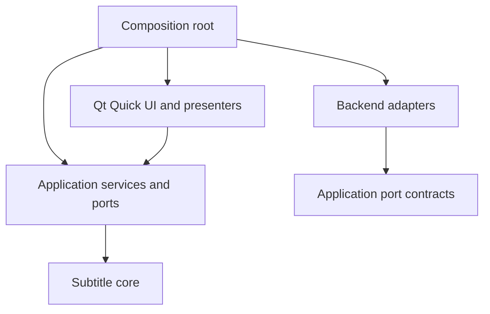

# Hikari-owned application architecture

Accepted foundation, 2026-09-27: [Own the HikariSub Qt application layer](../adr/0001-hikari-owned-qt-layer.md). This is the module contract for the rewrite, not a claim that the application has been implemented. The existing wx tree is reference material; it is not the new core or a library to wrap.

## Planned modules

| Module / planned source home | Owns | Boundary |
| --- | --- | --- |
| Core / `src/core` | Authoritative subtitle content, styles, script properties, time/frame values, editing operations and their invariants | No QML/Qt Quick, window, renderer, device, global UI settings or service-container dependency. Whether individual Qt Core value types are appropriate remains part of core interface design. |
| Application / `src/application` | Document/session lifetime, editing target and selection, command dispatch, undo transactions, action metadata, settings/shortcuts, workspace/navigation policy and task coordination | Depends on core and explicit backend ports. No duplicated subtitle model in controls and no implicit access through process-wide service lookup. |
| Backend adapters / `src/backends` | FFMS2/libass integration, audio/general playback, automation runtime, font/file/platform services and their resource lifetime | Implement the ports consumed by application services. Backend-specific handles stay inside their adapters. Renderer, A/V clock and thread contracts are separate decisions. |
| Qt Quick UI / `src/ui` | QML shell, reusable controls, panels, model adapters/presenters, focus and accessibility representation | Observes application state and submits commands. It does not become another authoritative document store or make native backend calls from delegates. |
| Composition root / `src/app` | Process startup, explicit service construction, Qt engine setup, platform adapter selection and orderly shutdown | Wires and owns dependencies once. It does not host document algorithms. |

The names above describe the intended new tree. The CMake target graph and dependency packages are settled by [Choose the dependency and build strategy for the stateless CMake build](https://github.com/altqx/hikari/issues/24); creating these production modules is later implementation work.

The adapter arrow denotes implementation of port contracts, not an application dependency on a concrete adapter. Runtime callbacks return through the specified port and application coordination path.

## State and command ownership

Each open document has one authoritative content state. A UI projection can cache presentation data, but writes pass through an application command and the core's invariants. Stable identity connects selection and model updates; its exact encoding and persistence are left to the document-model decision.

An action has a stable identity, user-facing metadata, enabled state and explicit scope. Menus, toolbar buttons, shortcuts and automation entry points route through the same command boundary where they represent the same operation. Focus selects an input context; it must not silently turn a protected comparison reference into the editing target. The shortcut-conflict policy and complete legacy action mapping remain settings/hotkey design work.

Application services own document transactions and undo history. Native text input may own an in-progress draft, but it must reconcile with document commands through a specified commit/cancel boundary. The [ASS editor prototype](https://github.com/altqx/hikari/issues/28) does not yet settle that boundary. Mutating Lua macros and bulk timing/style operations must eventually participate in the same document transaction policy.

Workers return results tagged to their request/document revision; the application decides whether they are still applicable before updating state. Each backend contract must specify cancellation, errors, resource ownership, callback thread and shutdown ordering. This establishes the required contract fields, not a chosen worker pool, threading framework or A/V clock.

## Application services HikariSub must provide

- Actions and shortcuts: discoverable commands, contextual routing, disabled reasons, localisation and accessible labels.
- Navigation: predictable panel traversal and focus restoration, native input/IME ownership, and semantic representations for custom views.
- Workspaces: one shared application layout, movable/floating panels, follow/pin tool targets and optional protected comparison, as [accepted in the workspace review](ux/workspaces.md). Native docking architecture and remaining menu/control placement still need their decisions.
- Appearance: reusable Qt Quick Controls styled through the [accepted Compact Studio visual language](ux/visual-language.md). UI appearance never changes ASS style data.
- Settings: explicit scopes, stable persisted identities and a one-shot legacy importer. Legacy theme files and theme selection are excluded from import.
- Tasks/dialogs: owned progress/cancellation and errors; synchronous script-dialog semantics are implemented without allowing a worker to manipulate QML directly.
- Localisation: TS authoring and QM runtime with unchanged script-facing lookup behavior, as specified in [localisation](localisation.md).

These services are owned modules with explicit construction and narrow interfaces. The foundation does not require a general IoC container, a third-party plugin SDK or adoption of Muse's module/resource conventions.

## Reuse and platform policy

Use Qt Quick Controls as the ordinary input/control foundation. Share HikariSub-specific semantics and visual tokens in the UI module rather than cloning controls separately in each panel. A custom-drawn surface must supply the keyboard and accessibility semantics that an ordinary control would otherwise provide.

FFMS2 and libass remain required by the map. Cross-platform adapters are the default; optional Windows-only backend adapters may be selected behind the same application boundary. The map's exclusion of a general plugin ecosystem does not remove those explicitly allowed backend extensions. Do not expose platform-specific types to the core or make a later macOS adapter impossible.

No Muse module is imported by default. Selective future reuse needs a recorded source revision, licence/notices, dependency closure and maintenance owner; UI similarity is not itself a reason to adopt framework code. The [docking research](https://github.com/altqx/hikari/issues/16) remains an input to the workspace decision, not a selected dependency.

The accepted [platform policy](platform-policy.md) starts from Qt 6.11.2, adopts 6.12 after release and verification, and advances Qt with explicit Windows 10 retirement later. The [compatibility contract](compatibility.md) requires named approval for behavioral departures; an individually approved defect fix becomes the default.

## Open design and verification

The document representation, per-format preservation/loss rules and individual defect dispositions, time/frame semantics, command/undo granularity and scheduler contracts still require their core design decisions. Build/dependency strategy, media/audio backends and release gates remain the corresponding map tickets. The [isolated automation boundary](automation.md) and [verified font contract](fonts.md) are accepted directions with explicit feasibility and detailed-design obligations. This foundation must not be presented as those remaining decisions having been made.

Implementation must verify dependency direction, command/selection behavior through filtering and undo, late/cancelled worker results, script transactions, native focus/IME/screen-reader behavior and lifecycle cleanup. There is no implementation or benchmark pass attached to this ADR; the completed research and throwaway prototypes are evidence for planning.
